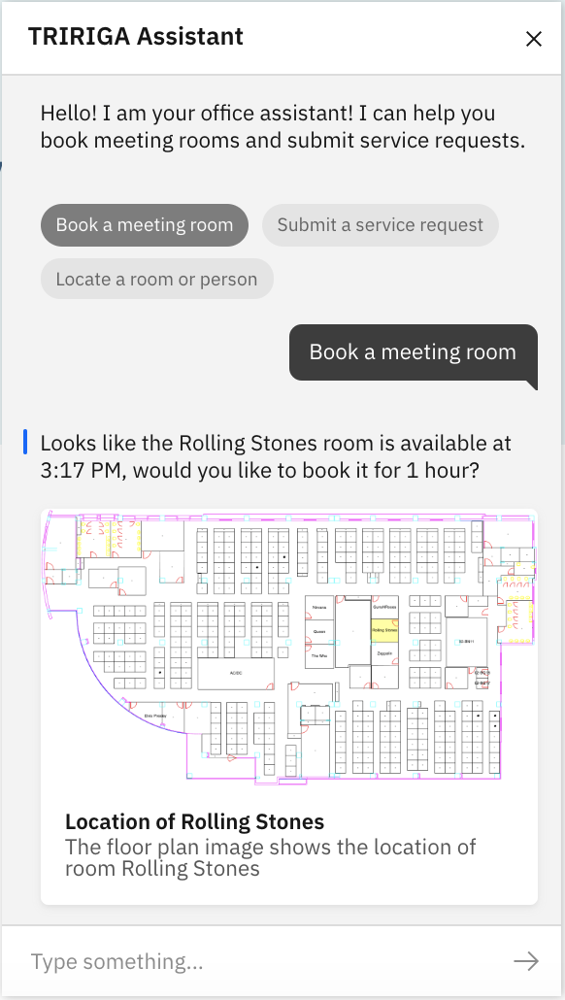

# IBM Tririga Assistant

An assistant for IBM TRIRIGA Workplace Services applications that enables users to book rooms, make service requests, locate people/places and ask questions with an AI assistant. 



---

## Introduction

TRIRIGA Assistant is an AI chatbot powered by the IBM Watson Assistant Service. It offers a brand new experience for employees to engage with their workplace services. It allows employees to make room reservations, report issues or lookup people using natural language.  

This is the free basic version of the assistant that is only accessible within TRIRIGA Workplace Experience Apps. The premium version has not yet been released, but it will allow more customizations, additional capabilities and it will open up the platform for creating your own custom skills.

These instructions will guide you through 1)  provisioning a TRIRIGA Assistant skill on the IBM Cloud, 2) installing and testing the OSLC APIs and 3) installing the chatbot interface into your workplace services apps. It is highly advisable that these steps are performed by a developer that is trained and experienced with IBM TRIRIGA.

## Prerequisites

- TRIRIGA 10.6.1/3.6.1 
- TRIRIGA Workplace Services apps deployed
- TRIRIGA Request Central and (optionally) TRIRIGA Reserve 
- TRIRIGA instance that is accessible securely from the internet. TRIRIGA Assistant is a SaaS service hosted securely on IBM cloud. The service will need to communicate via secured OSLC APIs to your TRIRIGA instance. This is usually not an issue for TRIRIGA SaaS customers.

## Estimated time

This installation should take 5-8 hours to complete, not including the time for IBM to provision the TRIRIGA Assistant skill.

## Steps

### Part 1 - Gather data

#### A) GATHER YOUR BUILDING AND ROOM NAMES.

You will need to run a few TRIRIGA Reports to gather a list of buildings, floors, and reservable spaces. These are the reports to run:

- All Buildings with Reservable Spaces: `triBuilding -  Find - All Buildings with Reservable Spaces` 
- Reservable Spaces: `triSpace - Reservable Space`


1. Log in to TRIRIGA account (your account should have access to run all of these - if not, you may need to ask the sys-admin for access)

2. In the top left of the menu click 'My Reports' (directly on 'My Reports', don't select the 'Report Scheduler' sub-menu)

3. Select 'System Reports' from the row of tab headers

4. In the Name filter enter `triSpace - Reservable Space` and press Enter (or click the 'apply filters')

5. This should list the 'triSpace - Reservable Space' report

6. In the 2nd column click the Paper+Run icon

7. The report will open in a separate window

8. You can use the 'Export' action at the top/bottom to export the results to a `.xlsx` file.

9. Repeat steps 4 through 8, but for the `triBuilding -  Find - All Buildings with Reservable Spaces` report by searching for `All Buildings with Reservable Spaces` in the Name column`.  
**Note**, if you don't find the query, there are two spaces after the first hyphen. Markdown removes the space when rendering this document. Searching for the latter part of the name should find just one query.

#### B) GATHER THE TIMEZONES FOR EACH BUILDING.

You will need to also run a TRIRIGA Report to gather the time zones for each building.

1.	Find the query named `Location - Find - Find All Property And Buildings` 
2.	Edit the query and add the `TimeZones` business object from the `Classification Module`. 
3.	In the Columns tab for that same query, click the Classification Module and select `Timezone` (triTimeZoneTX). 
4.	Click Save 
5.	Click Run Report 
6.	Click Export from the report window that appears 


### Part 2 - Import OSLC resources, create assistant user and test

#### C) LOAD THE OSLC RESOURCES.

1.	Create new Object Migration import package selecting the wa-tri-assistant-*.zip file provided in this folder.
2.	Validate and Import the OM package.
3.	If you can reserve rooms using the Workplace Services apps, then go to next step, otherwise you will need to define buildings, spaces, reservation space groups, reservation coordinators and other things following [this documentation](https://www.ibm.com/support/knowledgecenter/en/SSFCZ3_10.5.2/com.ibm.tri.doc/res_overview/t_ctr_manage_reservations.html) ([https://www.ibm.com/support/knowledgecenter/en/SSFCZ3_10.5.2/com.ibm.tri.doc/res_overview/t_ctr_manage_reservations.html](https://www.ibm.com/support/knowledgecenter/en/SSFCZ3_10.5.2/com.ibm.tri.doc/res_overview/t_ctr_manage_reservations.html))


#### D) SET UP THE ASSISTANT USER.

In order to allow the assistant user to create location reservations and service requests on behalf of other users, we have to create the user with the proper groups and licenses. 

1.  Create a user with user with the following:

    Groups: 
    - TRIRIGA Request Central 
    - TRIRIGA Request Central - Fundamentals 
    - TRIRIGA Request Central - Reserve
    - TRIRIGA Request Central - Reserve - Fundamentals
    - WAS Reserve OSLC
    
    License:
    - IBM Facilities and Real Estate Management on Cloud Self Service, or
    - IBM TRIRIGA Request Central, or
    - IBM TRIRIGA Workplace Reservation Manager

2.	Make note of the user name and password because it will need to be provided to IBM.
3.	Important: Do NOT give the assistant user a primary location.  This user will be used to book rooms and submit service requests on behalf of all users in the TRIRIGA instance.

#### E) (OPTIONAL) TEST THE OSLC ENDPOINTS.

If you understand Postman, then you can test the OSLC calls using the Postman collection provided in the postman directory.  You will need to change the payload to have 'location/building/space' you have defined in your TRIRIGA instance. A successful test of the OSLC APIs when there are no OSLC errors.
    

### Part 3 - Request the Assistant Integration ID

#### F) REQUEST YOUR ASSISTANT INTEGRATION ID.

Your integration ID will be used to connect your TRIRIGA with the Assistant Skill on the cloud. You will use this Integration ID in the next step.

To request your Integration ID, send the following to **[jtmoore@us.ibm.com](jtmoore@us.ibm.com)**:
1. The Excel files generated from the three reports:
- Reservable Spaces (Step A).
- All Active Locations (Step A).
- Location Timezones (Step B).
2. The URL for your TRIRIGA instance. Note: The instance must be accessible without a VPN and through HTTPS. 
3. The username and password for the assistant account (Step D).


### Part 4 - Add Assistant UI to Workplace Services apps

#### G) EDIT THE WORKPLACE SERVICES APP TO ADD CHAT UI ACCESS.

1.	Once you have received your Integration ID, open the Workplace Service view by going to Tools > Web View Designer > triWorkplaceServices.
2.	Copy the value in `Development Filename` and paste it as the value in the "Production Filename". (Note: This is done for testing purposes and can be reversed after testing passes. A link to instructions have been add below.)
3.	In the View Files section, click on `/trilazy-imports.html`.
4.	Click on the Download View File icon.
5.  Edit the `trilazy-importshtml` file and add the following below the last `<link>` tag line:

    ```html
    <link rel="import" href="../ibmTriAssistant/ibmTriAssistant.html">
    ```

6.  Upload the changes by clicking on the Upload view file icon.
7.  Click `Save & Close` button in upper right corner.

8.	In the View Files section, click on /triview-workplace-services-dev.html
9.	Click on the Download View File icon.
10.	Edit the `triview-workplace-services-devhtml` file and at the bottom of the template section, paste the following lines of code above the `</template>` so the following HTML is between the `<template>` and `</template>` lines:
**Make sure to replace `PASTE_THE_INTEGRATION_ID_HERE` with the Integration ID provided.**
    
    ```html
    <ibm-TriAssistant integration-id="PASTE_THE_INTEGRATION_ID_HERE" region="us-south" model-and-view="ibmTriAssistant" instance-id="-1" online="[[online]]"> </ibm-TriAssistant>
    ```
11. Upload the changes by clicking on the Upload view file icon.
12. Click `Save & Close` button in upper right corner.

#### H) EDIT THE ROOM RESERVATION AND SERVICE REQUEST VIEWS.

From the Web View Designer, repeat the same steps directly above for the other views: 
    - triRoomReservation View (edit files `trilazy-imports.html` and `triview-room-reservation-dev.html`).
    - triServiceRequest View (edit files `trilazy-imports.html` and `triview-service-request-dev.html`).

#### I) TEST THE WORKPLACE SERVICES APPS.

If all edits were done correctly, you should see a chat icon appear at the bottom right of the Workplace Services apps.  Log into the Workplace Services apps as a user that isn't the system or assistant user and test the assistant.

#### J) (OPTIONAL) VULCANIZE THE VIEWS.

If you feel that your workplace service apps are loading much slower after the edits, then you can "vulcanize" the apps [following these instructions](https://www.ibm.com/developerworks/community/wikis/home?lang=en#!/wiki/IBM TRIRIGA1/page/How to vulcanize your UX application).  If you do this, make sure you undo the change like F2 that sets the `Production Filename` to the `Development Filename`.

### Part 5 - Configure permissions for users 

#### K) ALLOW ASSISTANT USER TO CREATE RESERVATIONS ON BEHALF OF OTHER USERS.

1.	If assistant will be used to make room reservations, the `TRIRIGAWEB.properties` should have the `SHOW_PREFERENCES_LINK` env var set to `Y` 
    
    - (note you will need to restart your WebSphere server if you have to change this value).

2.	For each user that plans to use the assistant to create location reservations, they must do the following:
    - Click the Welcome, {name} in the main UI home page
    - Click the Preferences tab
    - Click the Reservation Delegates tab
    - In the Reservation Delegates section, click the Find button
    - Click the checkbox for the `triassistant` user and click OK

#### L) MODIFY OR CREATE NEW SECURITY GROUP

The OM package imported contains a new model for the UX apps. Non-admin users need to be given proper access to this model.  To accomplish this, you can either create a new security group or modify an existing.  The steps below modify the `TRIRIGA Request Central - Fundamentals` security group to allow users, that have this group, to read, update, create and delete the `ibmTriAssistant` model.

1.  From the TRIRIGA Main UI, go to "Tools > Security Manager".
2.  Click on the `TRIRIGA Request Central - Fundamentals` security group.
3.  In the window appears, click on the Access tab.
4.  Scroll down and expand the `Models` root and select `ibmTriAssistant`.
5.  In the "Model Access" panel on the right, select `Read,Update,Create and Delete`.
6.  Click Save & Close.

End of instructions.